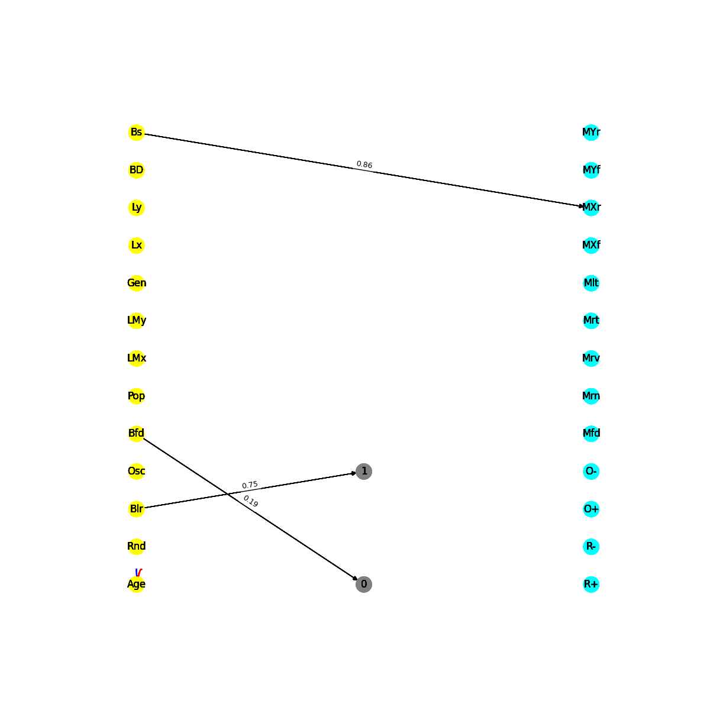
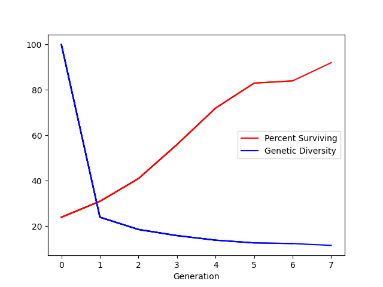

# 🧬 Evolution Sim

A from-scratch artificial life simulator where thousands of cells, each controlled by its own tiny neural network, live, move, and reproduce on a 2D grid. Every cell's brain is encoded directly in a genome of hexadecimal genes — no backprop, no training labels. Behavior emerges purely from **selection pressure** and **random mutation** across generations, à la [Bibites](https://leocaillon.itch.io/the-bibites) or David Miller's "biosim4".

🌐 **[View it live](https://mxrtin-beep.github.io/evo-sim.html)**

<p align="center">
  
  &nbsp;
  
</p>

## How it works

- **World** — a `WIDTH × HEIGHT` grid (`environment.py`) seeded with a population of cells at random, unoccupied positions.
- **Genome** — each cell (`cell.py`) gets a genome of hex-encoded genes. Every gene is decoded into a `source → sink` neural connection with a signed weight, wiring up the cell's brain.
- **Brain** — a tiny recurrent network (`brain.py`) of sensory, inner, and action neurons:
  - **Sensory neurons** feed in the cell's age, position, nearby population density, forward/side blockage, an oscillator, a random signal, genetic similarity to its forward neighbor, and more.
  - **Inner neurons** combine those signals with `tanh` activations.
  - **Action neurons** decide what to do — move forward/backward/left/right/N/S/E/W, move randomly, or tune the cell's own responsiveness/oscillator — firing whenever activation clears a per-neuron threshold.
- **Simulation loop** (`main.py`) — each generation runs for a fixed number of steps, rendered live with `pygame`. Every cell senses, thinks, and acts once per step.
- **Selection pressure** — at the end of a generation, cells outside a "safe zone" or in overly sparse neighborhoods die off. Survivors reproduce (sexually, mixing genes from multiple parents, or asexually) to refill the population, with a small per-base mutation rate.
- **Stats** — survival rate and genetic diversity are tracked and plotted every generation to `stats.png`.

<p align="center">
  
</p>

## Running it

```bash
pip install pygame numpy networkx matplotlib
python main.py
```

A window opens showing the population evolving in real time. Survival rate and genetic diversity charts are written to `stats.png` as the simulation progresses.

## Tuning

Key parameters live at the top of `main.py`:

| Parameter | Description |
|---|---|
| `POPULATION` | Number of cells per generation |
| `STEPS_PER_GENERATION` | Simulation steps before selection is applied |
| `N_GENERATIONS` | Number of generations to run |
| `MUTATION_RATE` | Probability of a mutation per gene base |
| `N_PARENTS` | Number of parents contributing genes to each child (sexual reproduction) |

Selection criteria (which cells survive) are defined in `Environment.enact_selection_pressure()` — swap in your own fitness function to evolve different behaviors.
