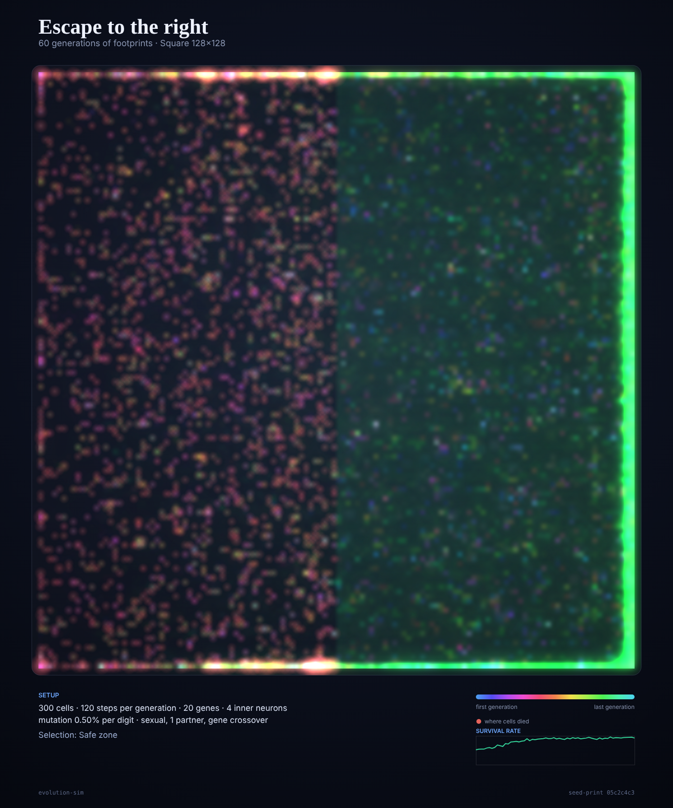

# 🧬 Evolution Sim

A from-scratch artificial-life simulator: hundreds of cells, each controlled by its own tiny neural network encoded in a genome of hex genes, live, move and reproduce on a 2D map. No backprop, no labels: behaviour emerges purely from **selection pressure** and **random mutation**. Inspired by [David Miller's "I programmed some creatures. They evolved."](https://www.youtube.com/watch?v=N3tRFayqVtk)

<p align="center"></p>

## Run it

```bash
pip install -r requirements.txt   # just numpy
python main.py                    # opens http://localhost:8000
```

Options: `--port 8080`, `--host 0.0.0.0`, `--no-browser`. Run the tests with `python -m unittest discover -s tests`.

## The interface

**1. Setup** (before the run)

<p align="center"></p>

- **Scenarios**: one-click presets (Escape to the right, Classic original rules, Mind the stripe, Herd instinct, Social distancing, Fortress, Alarm signals, ...).
- **Population & time**: population size, generation length (steps), number of generations, seed.
- **Genetics**: genes per genome, inner neurons, mutation rate.
- **Reproduction** (asexual by default): asexual (clones) or sexual with 1-9 partners per child; gene-level or digit-level crossover; equal or random breeding.
- **World**: 10 map shapes (square, circle, ring, diamond, cross, two chambers, hourglass, obstacle field, islands, spiral), any size, a spawn area, and zone presets. Paint your own walls / hazards / safe zones on the preview.
- **Brain neurons**: a brain-shaped checklist (senses, inner neurons, actions) where you can untick any neuron to remove it from every cell. Genes are re-mapped onto the neurons that remain, so no genes are wasted; disabled neurons show as dashed circles in the live brain view.
- **Mortality conditions** (combine any): hazard pixels within R px, safe zone, wall/edge proximity, neighbours in range (too few *or* too many), distance travelled (laziness / energy budget), net displacement from spawn, and random death. A cell dies as soon as any enabled rule says so.

**2. During the run**

- **Live world**, one pixel per cell in its own genome colour, with a speed slider (up to "max"), pause (`Space`), and click-a-cell to inspect it.
- **Death spots** toggle: translucent dots where cells died (all generations / last 10 / last one), optionally coloured by cause of death.
- **Last generation's deaths** (checkbox): little dark-red translucent spots showing where the previous generation died, while the next one is running.
- **Live charts** of death rate (% dying per generation) and genetic diversity, with hover read-outs. *Distinct genes* is the % of gene slots in the population holding a unique value; *genomes unlike the most common one* is the % of cells whose genome differs from the most common genome.
- **Brain evolution**: one brain drawn for the whole population. Every connection's opacity is the share of cells carrying it, so common wiring is solid and rare wiring fades; blue excites, red inhibits. Scrub or replay through the generations to watch the brain evolve, or select a single cell to see its own brain with live neuron activations.

- **Generation changeover** (checkbox): the run pauses for a few seconds at the end of each generation to show who died (crosses in their cause-of-death colour), who survived, and lines from each parent to the new cells that spawn in.
- **Hands** (webcam or mouse): your hands become part of the world. Turn on the *Hands* mortality rule (cells die while under a hand, or die unless under a hand at the end of the generation), then press *Webcam* (hand tracking by MediaPipe, running locally in your browser; the camera image never leaves it) or *Mouse* (the pointer is a hand). The hand is drawn as your real silhouette: the tracker finds where your hand is, then your skin colour (learned from your palm) decides which camera pixels belong to it, so it works like a shadow and keeps its true finger widths (it works best in even light; a skin-coloured background right behind your hand can make it look puffy). Tracking is rate-limited and falls back from GPU to CPU if the GPU is slow, so the page stays smooth. Cells also get a *Hand nearby* sense so they can evolve to dodge or chase your hands. The library and model (about 14 MB) are downloaded from jsdelivr and Google storage the first time you press *Webcam*; to run offline, put `vision_bundle.mjs`, `wasm/` (from `npm pack @mediapipe/tasks-vision@0.10.14`) and `hand_landmarker.task` in `web/vendor/mediapipe/`.

**3. The final artwork**

When a run ends (or any time via *Final art*) you get a downloadable PNG with nothing but the artwork: the paths walked by a sample of cells in every generation, drawn oldest first from blue (first generation) to orange (last). Random wandering in early generations gives way to the straight, purposeful lines of an evolved strategy.

<p align="center"></p>

## How it works

| File | Role |
|---|---|
| `evosim/genome.py` | Genes are 32-bit ints: source (sensor/inner), sink (inner/action), signed weight. Decoding, mutation, crossover, pruning of non-functional connections. |
| `evosim/simulation.py` | Vectorised numpy simulation: sense → think (batched tanh network) → act → selection → breeding. |
| `evosim/rules.py` | The mortality rules (data-driven; the UI is generated from this list). |
| `evosim/world.py` | Map shapes, zone presets, distance fields. |
| `evosim/scenarios.py` | Preset scenarios. |
| `evosim/server.py` | Dependency-free HTTP server and JSON API. |
| `web/` | The interface (plain JS and canvas, no build step). |

Each cell senses 19 things (age, noise, blockage, crowding, kinship, position, wall / hazard / safe-zone distance, nearest neighbour, distance walked, smell, ...) and chooses among 14 actions (move in 9 ways, tune its own responsiveness and oscillator, spray pheromone). Pheromone is a shared layer that every cell can smell; it spreads and fades at a rate set by *Pheromone persistence*, and you can watch it with the *Pheromone* toggle during a run. Optional world settings: *Alarm pheromone on death*, *Hazard / Safe-zone sense range* (make hazards hard to see) and *Moving hazards* (the hazard pattern shifts every generation, so cells can't just memorise where it is from their X/Y position). Spawning only happens on land connected to a safe zone, so no cell starts on an unreachable island.

### Changes from the original version
- pygame/matplotlib/networkx replaced by the browser interface; only `numpy` is required.
- Brain weights are now signed (the original only produced positive weights, so cells could never inhibit anything).
- Simulation is vectorised across the population (roughly 20x faster).
- Pixel-style flat interface (Helvetica, off-white, no gradients or shadows) instead of pygame windows.
- The hard-coded selection in `Environment.enact_selection_pressure()` is now configurable rules.
